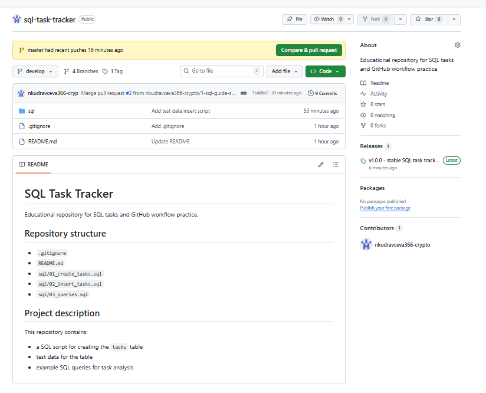
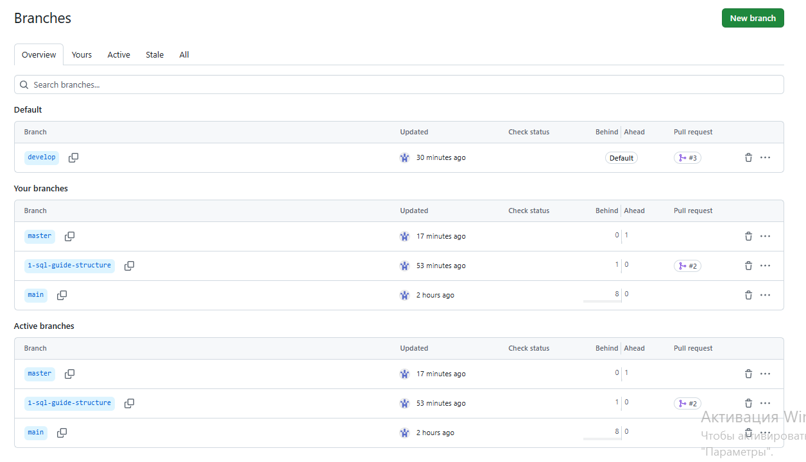
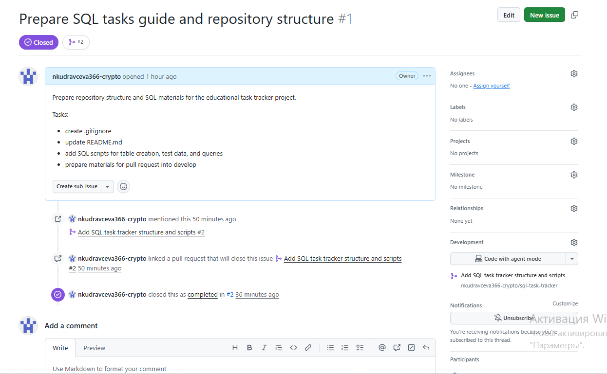
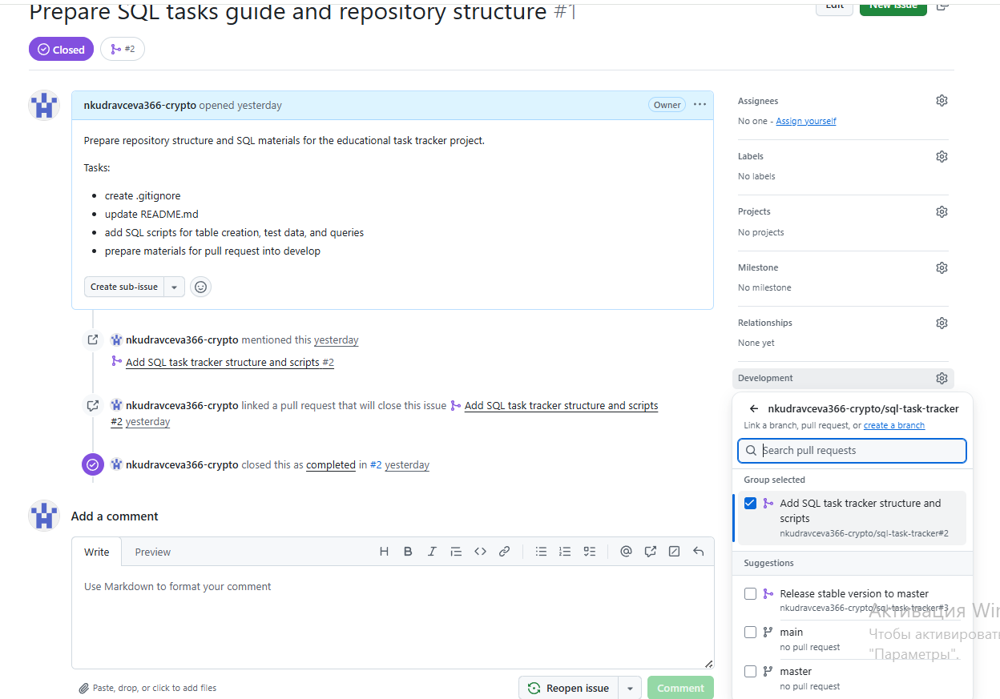
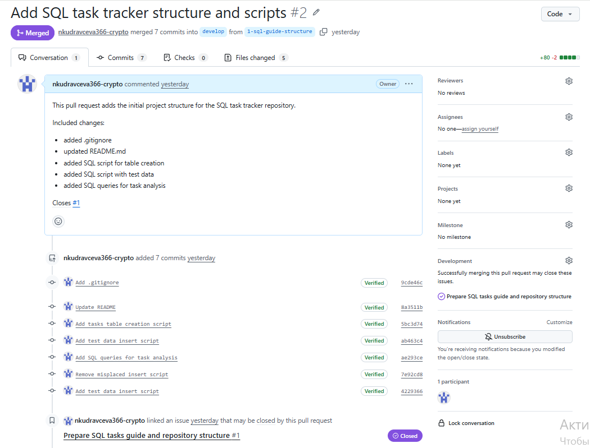
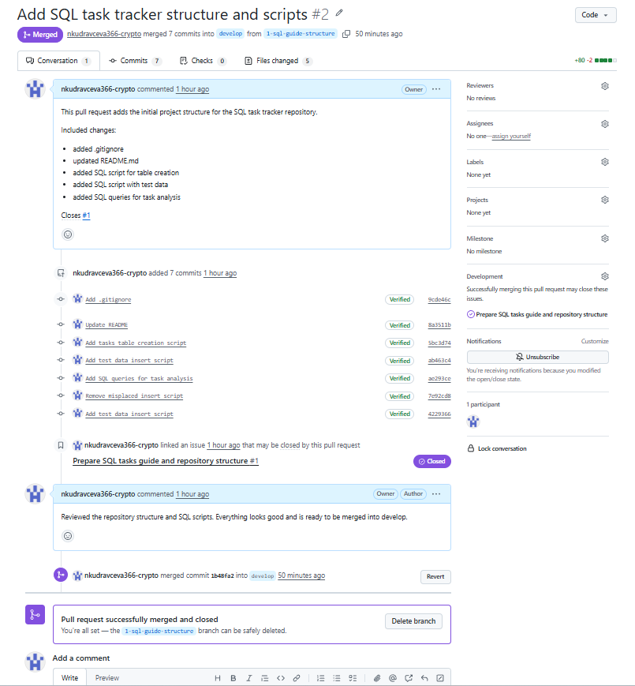
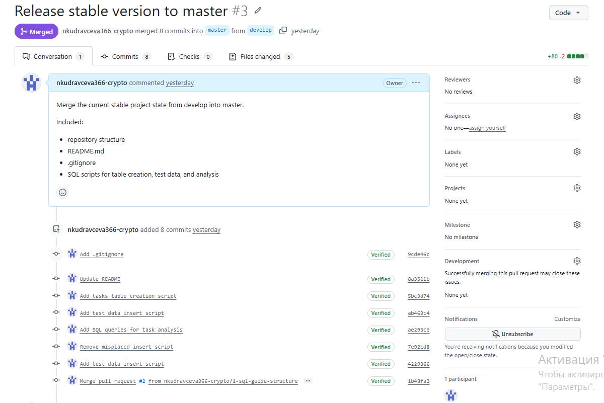
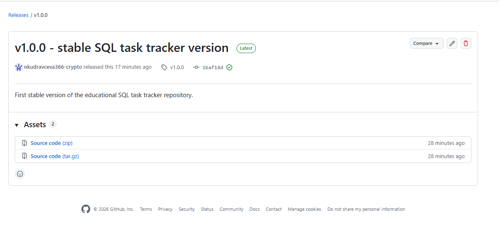
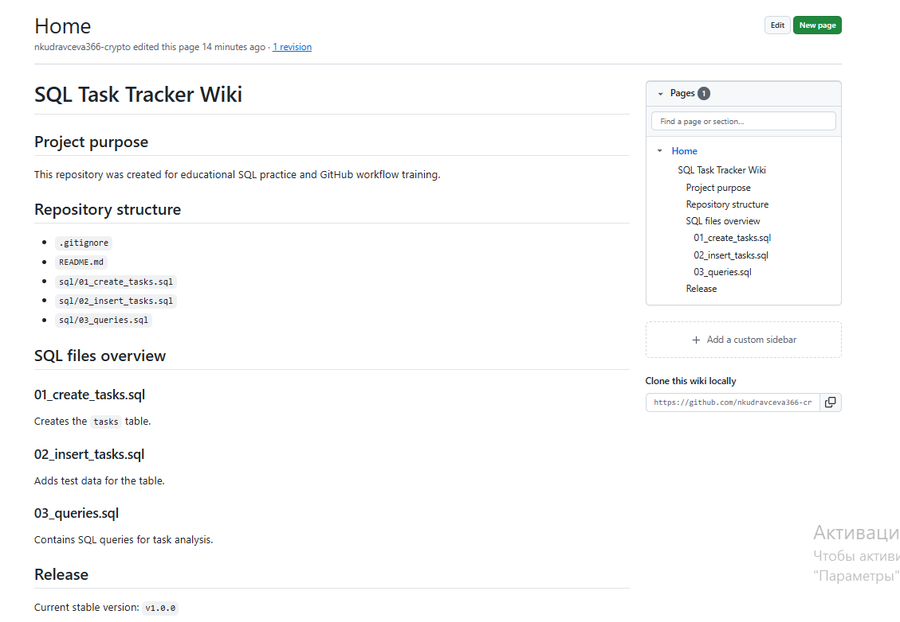

## 1. Создание личного репозитория с нужным файлом .gitignore и простым README.md

Был создан публичный учебный репозиторий `sql-task-tracker` для безопасной демонстрации GitHub workflow и SQL-заданий без чувствительных данных. В репозитории были добавлены файл `.gitignore` и базовый `README.md`.

## 2. Создание веток develop и master

В репозитории были созданы ветки `develop` и `master` для организации процесса разработки и формирования стабильной версии проекта.

## 3. Установка ветки develop по умолчанию

На странице веток видно, что ветка `develop` назначена веткой по умолчанию (`Default`) и используется как основная ветка разработки.

## 4. Создание проблемы для написания текущего руководства

Была создана issue `Prepare SQL tasks guide and repository structure`, в которой зафиксированы задачи по подготовке структуры репозитория и SQL-материалов.

## 5. Создание ветки по issue

Связь задачи с процессом разработки была оформлена через блок `Development`, где issue связана с соответствующим pull request и development-процессом.

## 6. Создание запроса на слияние ветки с develop

Изменения были оформлены в pull request `Add SQL task tracker structure and scripts` с направлением из рабочей ветки в `develop`.

## 7. Комментирование и принятие реквеста

К pull request был добавлен комментарий, после чего запрос был успешно принят и влит в ветку `develop`.

## 8. Формирование стабильной версии в ветке master с присвоением тега

После завершения основной разработки стабильная версия проекта была перенесена из `develop` в `master`. Затем был создан релиз и присвоен тег `v1.0.0`.

### Слияние в master

### Релиз и тег

## 9. Работа с wiki-проектом

Для репозитория была создана wiki-страница с описанием назначения проекта, структуры репозитория, содержимого SQL-файлов и текущей стабильной версии.

## 9. Работа с wiki-проектом

Для репозитория была создана wiki-страница с описанием назначения проекта, структуры репозитория, содержимого SQL-файлов и текущей стабильной версии.

